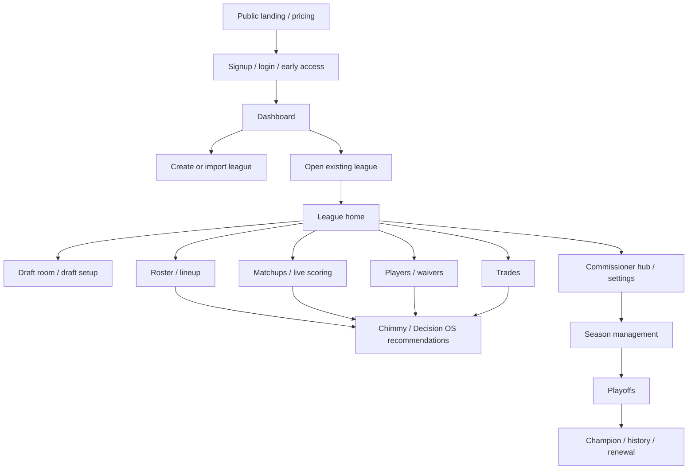

# G21 - Customer Experience & Visual Production Audit

Readiness is held at:

- NFL Engine: 93%
- Overall Platform: 90%

## G21B Blocker Cleanup Update

G21B performed bounded customer-facing cleanup without changing core engine behavior.

### Blockers Fixed

| Blocker | Status | Files |
| --- | --- | --- |
| Mojibake / encoding artifacts | Partially fixed in high-visibility customer surfaces. Removed obvious corrupted symbols from the active landing client, commissioner/league/draft/roster launch surfaces, and e2e loading copy. Remaining non-English proper Unicode is intentionally preserved; deeper translation cleanup is still recommended. | `components/landing/LandingPageClient.tsx`, `app/commissioner-hub/CommissionerHubPageClient.tsx`, `app/league/[leagueId]/LeagueShell.tsx`, `app/league/[leagueId]/tabs/TeamTab.tsx`, `app/league/[leagueId]/tabs/LeagueTab.tsx`, `components/app/draft-room/DraftTopBar.tsx`, `app/e2e/draft-room/E2eDraftRoomHarnessClient.tsx` |
| Stale customer/UI smoke expectations | Fixed. Updated stale source-contract tests for completed-draft entry, encoded draft-session redirect, and the current `Players / Waivers` combined redraft tab. | `__tests__/nfl-redraft-league-dashboard.test.ts`, `__tests__/league-shell-waivers-layout.test.tsx` |
| Landing browser selectors | Fixed. Added stable IDs to the active landing client, added a mobile sticky CTA to the active page, and aligned the smoke with current stable routes instead of removed `/app`, theme-toggle, language-toggle, and full route-crawl assumptions. | `components/landing/LandingPageClient.tsx`, `e2e/landing-page-click-audit.spec.ts` |
| Dashboard browser smoke | Fixed. Restored a deterministic dashboard e2e harness for the current dashboard surface, updated stale tabbed-dashboard expectations, and fixed mobile horizontal overflow by containing the dashboard root. | `app/e2e/dashboard-soccer-grouping/page.tsx`, `e2e/unified-dashboard-click-audit.spec.ts`, `app/dashboard/DashboardContent.tsx` |
| Beta/future labels | Improved. Made visible “soon” labels explicit as “Coming Soon” for roster trade-hub and draft-helper placeholder surfaces. Existing Commissioner Hub Beta/Coming Soon labels remain in place. | `app/league/[leagueId]/tabs/TeamTab.tsx`, `components/app/draft-room/DraftHelperFloatingWindow.tsx`, `app/commissioner-hub/CommissionerHubPageClient.tsx` |
| Decision OS trust affordance | Improved. Added a lightweight dashboard AI entry-point note that Decision tools should surface confidence and source context when league data is available. Chimmy message bubbles already mount `ChimmyTrustPanel` for confidence, sources, missing signals, and freshness. | `app/dashboard/DashboardContent.tsx`, `components/chimmy/ChimmyMessageBubble.tsx`, `components/chimmy/ChimmyTrustPanel.tsx` |

### G21B Tests Run

Customer/UI smoke:

```text
cmd /c npx vitest run __tests__/dashboard-shell-layout.test.tsx __tests__/nfl-redraft-responsive-ux-smoke.test.ts __tests__/nfl-redraft-league-dashboard.test.ts __tests__/league-page-resilience.test.tsx __tests__/league-shell-waivers-layout.test.tsx __tests__/redraft/waiver-add-drop-ux.test.tsx __tests__/redraft/players-waivers-deep-build.test.tsx __tests__/draft/d9-mobile-responsive.test.ts __tests__/draft/draft-room-ui-state.test.ts __tests__/draft/draft-board-layout.test.ts __tests__/draft/pool-loading-state.test.ts __tests__/commissioner-control-center-timer-ui.test.tsx __tests__/commissioner-settings-route.test.ts __tests__/chimmy-trust-panel.test.tsx __tests__/chimmy-theme-readability.test.tsx __tests__/chimmy-response-aggregator.test.ts __tests__/create-league-v2-modes-ui.test.tsx __tests__/create-league-v2-form-completion.test.ts __tests__/required-public-media-assets.test.ts
```

Result:

- 16 test files passed.
- 194 tests passed.

Browser smoke:

```text
cmd /c npx playwright test e2e/landing-page-click-audit.spec.ts --project=chromium --reporter=line --workers=1
```

Result:

- 2 passed.

```text
cmd /c npx playwright test e2e/unified-dashboard-click-audit.spec.ts --project=chromium --reporter=line --workers=1
```

Result:

- 1 passed.

```text
cmd /c npx playwright test e2e/draft-room-click-audit.spec.ts --project=chromium --reporter=line --workers=1
```

Result:

- 1 failed before reaching draft UI assertions.
- Remaining blocker: `gotoDraftRoomHarness` times out after 120 seconds while polling `/` for server readiness. The failure occurs before the draft-room page is opened, so this remains classified as a Playwright harness/server-readiness blocker rather than a verified draft-room UI regression.

### G21B Remaining Customer-Facing Blockers

| Severity | Blocker | Status |
| --- | --- | --- |
| P0 | Draft-room browser harness readiness | Deferred. Needs harness/server readiness isolation before draft-room browser proof can be trusted. |
| P1 | Full translation/mojibake cleanup | Partially fixed. English/default launch surfaces are improved, but a deliberate translation pass is still recommended before multilingual launch. |
| P1 | Meta CAPI local dev noise | Deferred. Playwright web server logs repeated placeholder Meta Pixel errors; tests can still pass, but the noise slows diagnosis. |
| P1 | Full browser route crawl | Deferred. Landing smoke no longer crawls every linked route because unrelated routes can stall local Next dev. Route health should move to a separate route-health suite with per-route timeouts. |

Readiness remains:

- NFL Engine: 93%
- Overall Platform: 90%

This audit reviewed the customer-facing AllFantasy experience after the core engine audits. No production UI behavior was changed. The main conclusion is that the product has broad feature depth and meaningful state handling, but launch readiness now depends on visual consistency, trust copy, mobile proof, stale browser selectors, and clear beta/future labeling.

## 1. User Journey Map



Customer trust is won or lost at four moments:

- First impression: landing, pricing, signup, login, and trust/legal copy.
- First league entry: dashboard, empty states, import/create CTAs, and onboarding.
- First live action: draft room, roster move, waiver claim, trade proposal, or matchup refresh.
- First commissioner action: settings save, schedule/draft controls, trade/waiver approval, and audit/confirmation messages.

## 2. Page / Surface Inventory

| Surface | Primary files reviewed | Current shape |
| --- | --- | --- |
| Public landing | `app/page.tsx`, `components/landing/LandingPageClient.tsx`, `components/landing/*` | Rich marketing page with SEO metadata, language support, CTAs, social proof, and fantasy-only disclaimers. High copy risk due visible mojibake in multiple strings. |
| Signup / login / early access | `app/signup/SignupContent.tsx`, `app/login/LoginContent.tsx`, `app/early-access/confirm/page.tsx`, `components/auth/*` | Mature account flows with validation, social auth gates, phone/email verification, geo/legal gates, and loading/error states. Needs copy polish and browser selector update. |
| Pricing | `app/pricing/page.tsx`, `components/monetization/MonetizationPurchaseSurface.tsx` | Present and SEO-backed. Needs launch-level plan clarity, payment boundary clarity, and cancellation/trust proof in browser. |
| Dashboard | `app/dashboard/components/DashboardOverview.tsx`, dashboard e2e specs | Dense, feature-rich command center with onboarding, live scores, widgets, create/import paths, AI tools, and empty fallbacks. Needs visual hierarchy pass and current browser smoke repair. |
| League home | `app/league/[leagueId]/LeagueShell.tsx`, `app/league/[leagueId]/tabs/LeagueTab.tsx`, league home components | Central league shell has tabs, home hero, rules summary, activity, standings, settings modal, specialty format entries, and chat panels. Needs copy encoding cleanup and tab contract/test alignment. |
| Matchups | `components/matchup-center/MatchupTabContainer.tsx`, matchup-center components | Good state model: refresh, age label, loading spinner, error banner, empty starter rows, AI analysis panel, start/sit modal. Needs mobile row density proof and clearer source/freshness labels near win probability. |
| Team / roster | `app/league/[leagueId]/tabs/TeamTab.tsx`, roster helpers, player media components | Deep roster surface with lineup editing, bench/IR/taxi/devy handling, lock messaging, player detail sheet, AI start/sit handoff. Needs injury-data limitation label and mobile overflow pass. |
| Draft room | `components/app/draft-room/DraftRoomPageClient.tsx`, `DraftTopBar.tsx`, `CommissionerControlCenterModal.tsx`, draft e2e specs | Most mature customer surface: board, pool, queue, chat, timer, commissioner controls, mobile tabs, post-draft summary, AI handoffs. Browser smoke currently has harness timeout. |
| Commissioner hub | `app/commissioner-hub/CommissionerHubPageClient.tsx`, `components/commissioner-hub/*`, commissioner control tests | Strong commissioner positioning, mission queue, setup health, migration center, trust block, empty state. Needs encoding cleanup and stronger confirmations around high-impact actions. |
| Chimmy / AI | `components/chimmy/*`, `components/chimmy-surfaces/*`, `lib/decision-os/*` | Trust panel exists with confidence, contributing signals, missing signals, freshness, and sources. Needs consistent surfacing on every AI output and stricter visible Decision OS boundary. |
| Settings | `app/league/[leagueId]/settings/*`, `LeagueSettingsTab.tsx`, commissioner settings routes/tests | Broad settings coverage. G15 identified enforcement risk; UX needs beta/future labels for cosmetic or partially wired settings and clearer save confirmations. |

## 3. Readiness Table

| Surface | Classification | Reason |
| --- | --- | --- |
| Landing | Needs visual polish / trust polish | Feature-rich and SEO-backed, but visible mojibake and stale browser selectors block launch confidence. |
| Signup / login | Mostly production-ready, needs copy/browser proof | Validation and loading/error states are present. Needs final mobile/browser pass and clean legal/trust copy. |
| Pricing | Needs trust polish | Route exists and checkout surface is centralized. Needs launch copy, payment boundary clarity, and plan entitlement verification. |
| Dashboard | Needs visual polish | Strong functionality, but information density is high and the current dashboard e2e selector expectation is stale/failing. |
| League home | Needs polish / contract cleanup | Core league shell is broad and powerful. Mojibake and tab contract drift need cleanup before launch. |
| Matchups | Near production-ready, needs trust labels | Loading/error/empty states are good. Win probability and AI panels need visible source/freshness disclosures. |
| Team / roster | Needs mobile and data limitation polish | Roster engine behavior is deep. Injury/feed limitations and mobile row density need launch pass. |
| Draft room | Strongest surface, needs browser stabilization | The mobile/desktop architecture is extensive, but Playwright harness timeout blocks clean proof. |
| Commissioner hub | Needs trust polish | Good mission queue and trust framing. Needs confirmation/audit UX consistency for dangerous actions. |
| Chimmy / AI | Needs Decision OS consistency | Trust panel exists. Gap is consistent evidence display and clear AI-narrative boundaries across all entry points. |
| Settings | Needs beta/future labels | Many settings exist. Any cosmetic or partially enforced settings must be hidden, disabled, or marked beta/future. |

## 4. Visual Polish Gaps

| Severity | Surface | Gap | Launch impact |
| --- | --- | --- | --- |
| P0 | Public, league, commissioner, roster, draft | User-visible mojibake appears in copy and labels, including arrow, bullet, emoji, and accented-language strings. | Looks broken even if the engine is correct; undermines trust immediately. |
| P0 | Landing, dashboard, draft room | Browser smoke selectors are stale or harness readiness is unstable. | Visual proof is not trustworthy until e2e is green. |
| P1 | Dashboard | Too many first-screen modules compete for attention. | New users may not know whether to create, import, inspect, or ask AI first. |
| P1 | League shell | Specialty format tabs and labels are visually rich but inconsistent and vulnerable to encoding issues. | Future formats may feel experimental instead of first-class. |
| P1 | Commissioner hub | Good trust copy exists, but action confirmations are not uniformly visible across settings, draft, waiver, trade, schedule, and playoff controls. | Commissioners may fear irreversible changes. |
| P2 | Matchups / roster | Dense rows need final alignment pass across desktop and mobile. | Heavy users can adapt, but launch polish will feel uneven. |

## 5. Mobile Gaps

| Surface | Current evidence | Gap |
| --- | --- | --- |
| Landing | Mobile Playwright audit exists. | Current mobile landing test fails because expected CTA/test IDs are missing or changed. |
| Dashboard | Mobile bottom nav audit exists. | Current dashboard smoke fails before assertions complete because expected welcome copy is missing or changed. |
| League home | Responsive classes and shell layout exist. | Need full phone proof for tab navigation, chat rails, and settings modal. |
| Matchups | Component uses compact controls and row lists. | Need browser proof for starter rows, AI panel, and modal on phone viewport. |
| Roster | Many responsive patterns and bottom sheets exist. | Need overflow proof for long player names, DEF/ST, IR/taxi/devy sections, and lineup lock messaging. |
| Draft room | Dedicated mobile layout, quick dock, and mobile tab e2e exist. | Current draft room browser smoke times out in full harness before proving the suite. |
| Commissioner hub | Responsive grid/classes exist. | Need phone proof for mission queue, migration actions, and trust disclosures. |

## 6. Trust Gaps

| Severity | Surface | Gap | Recommended fix |
| --- | --- | --- | --- |
| P0 | Public/marketing | Mojibake and malformed symbols in customer copy. | Run a UTF-8 copy audit and add a text-integrity test over public/customer files. |
| P0 | AI/Chimmy | Trust panel exists but is not guaranteed on every AI/Decision OS output. | Require confidence, evidence, missing data, and freshness metadata for all AI surfaces. |
| P0 | Settings | G15 found settings can be enforced, partial, cosmetic, or future-only. | Add visible Beta/Future/Disabled labels or hide settings until enforced. |
| P1 | Matchups | Win probability and projections need source/freshness context at point of use. | Add compact freshness/source labels near probability and projection-heavy cards. |
| P1 | Commissioner actions | Some actions rely on toast feedback instead of persistent confirmation/audit context. | Standardize confirmation and audit copy for dangerous actions. |
| P1 | Pricing/payment | AllFantasy/FanCred boundary exists in copy, but should be prominent near paid flows. | Add payment/dues boundary disclosure close to checkout and paid league setup. |

## 7. Empty / Loading / Error State Gaps

Positive findings:

- `MatchupTabContainer` has loading, error, empty starter rows, manual refresh, age labels, and silent realtime refresh.
- Signup/login flows have validation, error messages, loading flags, password visibility controls, and provider config failure handling.
- Dashboard data fetches catch failures and fall back to safe empty summaries.
- Draft room has pool readiness/loading, disabled pick states, commissioner disabled states, and post-draft states.
- Commissioner hub has empty state for no leagues.

Remaining gaps:

| Surface | Gap |
| --- | --- |
| Public landing | Client-only loading fallback is minimal; launch polish should use branded skeleton/fallback instead of plain loading text. |
| Dashboard | Empty, loading, and error states exist but are not standardized across all widgets. |
| League home | Activity/standings/rules states should share one visual state system. |
| Roster | Some data limitations are phrased as "coming soon" or tooltips, not always as durable empty/error cards. |
| Settings | Save/loading/error confirmation varies by modal/tab. |
| Chimmy | Inline error/retry exists; insufficient-data responses need consistent user-facing styling everywhere. |

## 8. Beta / Future Labels Needed

These areas should be hidden, disabled, or explicitly labeled Beta/Future until browser-proven and engine-enforced:

- Auction draft, offline draft, imported draft flows, and advanced commissioner draft automation where not fully enforced.
- AI Commissioner prompts and automated commissioner actions.
- Non-Redraft specialty concepts that rely on partial plugin behavior: Dynasty, Keeper, Best Ball, Guillotine, Survivor, Tournament, Big Brother, Zombie, Devy, C2C, IDP.
- Trade settings that are not fully enforced end to end: veto mode variants, review windows, lock windows, max assets, pick trading in every route.
- Waiver modes or windows that are not fully enforced by both route and scheduler.
- Playoff settings that are cosmetic, partial, or deferred to G14 migration.
- Injury/live-feed dependent projections where provider coverage is partial.
- Any Decision OS recommendation that lacks evidence, confidence, source, or freshness metadata.

## 9. Highest-Impact Fixes

| Priority | Fix | Why |
| --- | --- | --- |
| P0 | UTF-8/customer copy cleanup across `app` and `components`. | The platform cannot feel production-ready while visible text contains mojibake. |
| P0 | Repair landing/dashboard/draft-room Playwright smoke selectors and harness readiness. | Launch readiness needs browser proof, not just component tests. |
| P0 | Add a customer-copy integrity test for mojibake patterns in launch surfaces. | Prevents regression after the cleanup. |
| P0 | Enforce visible AI evidence/freshness/insufficient-data copy across Chimmy and AI tools. | Aligns the visible product with the G20 Decision OS contract. |
| P1 | Standardize empty/loading/error state components for customer surfaces. | Reduces visual drift and improves trust under degraded data. |
| P1 | Settings Beta/Future/Disabled labeling pass. | Prevents commissioners from trusting cosmetic settings. |
| P1 | Mobile critical-path browser pass: landing, signup, dashboard, league home, roster, matchups, draft room, commissioner hub. | Most visible launch polish risk is small-screen density and control reachability. |
| P2 | Dashboard visual hierarchy pass. | Reduce first-screen cognitive load after core trust blockers are fixed. |

## 10. Recommended Visual Roadmap

### Stage 1 - Launch Trust Sweep

- Fix mojibake in public, signup/login, league shell, roster, draft, commissioner, and Chimmy copy.
- Add a text-integrity test that scans launch surfaces for common mojibake tokens.
- Repair landing/dashboard/draft-room Playwright smoke tests.
- Add visible Beta/Future/Disabled labels to settings and feature entries that are not fully enforced.

### Stage 2 - Browser-Proven Critical Path

- Run and keep green the Playwright smoke path for:
  - landing desktop/mobile
  - signup/login
  - dashboard
  - league home
  - roster
  - matchups
  - draft room desktop/mobile
  - commissioner hub/settings
  - Chimmy
- Capture visual evidence for mobile layouts at a phone viewport and desktop layouts at a common laptop viewport.
- Add data-freshness and evidence labels near projections, win probability, AI analysis, waiver recommendations, and trade recommendations.

### Stage 3 - Product Polish

- Normalize dashboard and league-home information hierarchy.
- Create shared launch-grade state components for empty/loading/error/degraded data.
- Standardize commissioner confirmation and audit feedback.
- Consolidate AI trust UI so every recommendation has confidence, sources, missing-data, and actionability.

## Test Coverage

### Focused UI / contract smoke

Command:

```text
cmd /c npx vitest run __tests__/dashboard-shell-layout.test.tsx __tests__/nfl-redraft-responsive-ux-smoke.test.ts __tests__/nfl-redraft-league-dashboard.test.ts __tests__/league-page-resilience.test.tsx __tests__/league-shell-waivers-layout.test.tsx __tests__/redraft/waiver-add-drop-ux.test.tsx __tests__/redraft/players-waivers-deep-build.test.tsx __tests__/draft/d9-mobile-responsive.test.ts __tests__/draft/draft-room-ui-state.test.ts __tests__/draft/draft-board-layout.test.ts __tests__/draft/pool-loading-state.test.ts __tests__/commissioner-control-center-timer-ui.test.tsx __tests__/commissioner-settings-route.test.ts __tests__/chimmy-trust-panel.test.tsx __tests__/chimmy-theme-readability.test.tsx __tests__/chimmy-response-aggregator.test.ts __tests__/create-league-v2-modes-ui.test.tsx __tests__/create-league-v2-form-completion.test.ts __tests__/required-public-media-assets.test.ts
```

Result:

- 14 test files passed.
- 190 tests passed.
- 2 files failed with 4 stale source-contract expectations:
  - `__tests__/nfl-redraft-league-dashboard.test.ts`
    - expects old draft-room gating/source text.
  - `__tests__/league-shell-waivers-layout.test.tsx`
    - expects a standalone `{ id: 'waivers', label: 'Waivers' }` tab and old deep-link mapping, while the current shell uses `players` as `Players / Waivers`.

Classification: test-signal cleanup. These failures are not evidence from this audit of a customer-visible runtime crash, but they block clean visual-production confidence.

### Browser smoke

Command:

```text
cmd /c npx playwright test e2e/landing-page-click-audit.spec.ts e2e/unified-dashboard-click-audit.spec.ts e2e/draft-room-click-audit.spec.ts --project=chromium --reporter=line
```

Result:

- Timed out after 181 seconds.
- 4 failures were reported before the remaining 7 tests could run:
  - `landing-page-click-audit.spec.ts`: missing `landing-logo-link`.
  - `landing-page-click-audit.spec.ts`: missing `landing-hero-cta-group`.
  - `unified-dashboard-click-audit.spec.ts`: expected `Welcome back,` copy not found.
  - `draft-room-click-audit.spec.ts`: full draft room harness timed out waiting for readiness.

Classification: browser proof blocker. The suite exists, but the current selectors/harness readiness are not clean enough to support a launch-readiness increase.

## Readiness Assessment

Do not increase readiness from G21 audit alone.

- NFL Engine remains 93%.
- Overall Platform remains 90%.

The Core Engines are much better mapped than the customer-facing proof layer. G21 should be treated as the handoff into a visual/trust hardening phase: fix copy encoding, stabilize browser smoke, label unsupported settings/features honestly, and then reassess customer readiness after browser-proven fixes.

---

## G21C Draft Room Harness Stabilization Update

Date: 2026-07-01

### Root Cause

The draft-room Playwright audit was timing out before UI assertions because `gotoDraftRoomHarness` used `/` as a readiness gate. On cold `next dev` startup, root-page rendering can spend the whole timeout compiling and initializing customer-facing shell work before the draft harness route is ever visited.

Additional audit note: this local `C:\Users\Guap_\OneDrive\Documents\AF\allfantasy-v2-main` checkout resolves through a junction to `F:\allfantasy-v2-main`, so the `F:` stack paths in Playwright output are not, by themselves, evidence of a second stale checkout.

### Fix Applied

- Updated Playwright `webServer` readiness from socket/port readiness to `http://127.0.0.1:3101/api/auth/csrf`.
- Replaced the draft harness `/` readiness poll with a lightweight `/api/auth/csrf` probe that records the last status/error.
- Let the browser `page.goto('/e2e/draft-room?...')` own the actual draft-room route load, with a longer first cold-load timeout.
- Updated the round-one announcement assertion to tolerate the production auto-dismiss window while still clicking the real skip control when the overlay is visible.

### Playwright Results

```text
cmd /c npx playwright test e2e/draft-room-click-audit.spec.ts --project=chromium --reporter=line --workers=1
```

Result: 8 passed.

```text
cmd /c npx playwright test e2e/landing-page-click-audit.spec.ts e2e/unified-dashboard-click-audit.spec.ts --project=chromium --reporter=line --workers=1
```

Result: 3 passed.

### Remaining Draft-Room Browser Notes

- Draft-room browser coverage is restored; assertions now reach and exercise the draft UI.
- The dev server still emits noisy local-only Meta CAPI and NextAuth/client-fetch logs during e2e runs. These did not fail the browser audits, but they remain launch-polish noise to clean up separately.
- No readiness increase from G21C. NFL Engine remains 93%; Overall Platform remains 90%.
