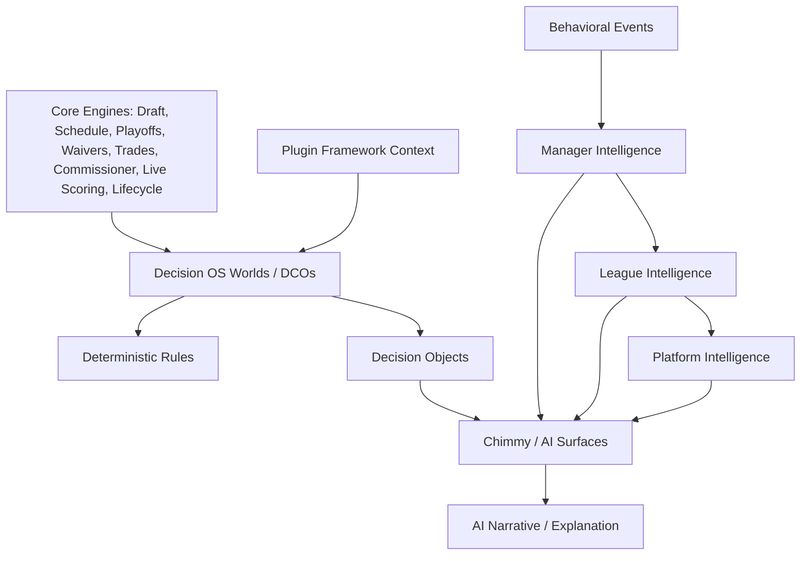

# G20 Decision OS Integration Audit

Readiness hold:

- NFL Engine: 93%
- Overall Platform: 90%

G20 is audit-first. The only implementation added is a safe Decision OS integration contract for evidence, derivation chain, plugin context, recommendation metadata, and AI narrative boundaries. No Chimmy rewrite, provider integration, or Redraft behavior change was made.

## 1. Current AI/Intelligence Architecture Map



Strong deterministic Decision OS areas:

- `lib/decision-os/core/decision.ts`: Canonical Decision object with four required answers.
- `lib/decision-os/lineup/*`: Lineup world, rules, decisions, parity/shadow.
- `lib/decision-os/waiver/*`: Waiver DCO, rules, deterministic recommendation mapping.
- `lib/decision-os/trade/*`: Trade DCO, rules, canonical memo/shadow, deterministic trade decision.
- `lib/decision-os/commissioner-health/*`: Commissioner health rules and decision outputs.
- `lib/decision-os/world/*`: Canonical world enrichment for schedule, injury, ADP, projection, weather, news, league intelligence.
- `lib/decision-os/behavioral/*`: Manager, league, and platform behavioral intelligence.
- `lib/intelligence/*`: API/query layer and Chimmy grounding helpers.

Mixed or AI-facing areas:

- `lib/chimmy-*`, `lib/chimmy-context`, `lib/chimmy-orchestration`: Deterministic context extraction plus AI response orchestration.
- `lib/redraft/ai/*`: Redraft-specific AI tools for matchup, waivers, trade analysis, commissioner assistance, weekly recaps.
- `lib/trade-engine/*ai*`, `lib/waiver-engine/*grok*`, `lib/waiver-ai-engine/*`: Deterministic scoring plus AI enrichment in some paths.
- `lib/league-recommendations/*`: Deterministic recommendation reasons with optional AI explanation polish.
- `lib/league-story-creator/*`, `lib/league-power-rankings/*AI*`: Provider narrative layers on top of deterministic facts.

## 2. Deterministic vs AI-Generated Classification

| Area | Classification | Notes |
| --- | --- | --- |
| Decision core object | Deterministic | Enforces four-answer contract; no I/O. |
| Lineup Decision OS | Deterministic | DCO/rules/decision/shadow pattern. |
| Waiver Decision OS | Mixed, mostly deterministic | Decision consumes deterministic suggestions and ignores optional AI prose. |
| Trade Decision OS | Deterministic | Wraps deterministic trade snapshot and rule verdicts. |
| Commissioner health Decision OS | Deterministic | Rule-based health decisions. |
| Canonical world enrichment | Deterministic with provider-derived facts | Enriches world; provider freshness/completeness must remain explicit. |
| Behavioral manager intelligence | Deterministic | Pure read-only derivation; no AI. |
| Behavioral league intelligence | Deterministic | Aggregates manager intelligence and league facts. |
| Behavioral platform intelligence | Deterministic | Aggregates league/manager behavior. |
| Chimmy context providers | Mixed | Mostly deterministic context assembly; downstream narrative can be AI. |
| Chimmy orchestration | Mixed | Routing/confidence deterministic; provider responses are narrative risk surface. |
| Redraft AI routes | Mixed | Some consume engine facts; some provider prompts can become narrative-first. |
| Waiver AI engine/routes | Mixed | Deterministic waiver scoring exists; Grok/OpenAI layers must stay explanation/enrichment only. |
| Trade AI analyzer routes | Mixed | G17 separated transactional trade engine; legacy analyzer still AI-facing. |
| Draft AI/live draft brain | Mixed | Deterministic pick engine and ADP exist; AI manager/recommendation routes need strict evidence boundaries. |
| Long-term coaching/fantasy coach | Mixed | Deterministic coaching snapshots plus AI narrative. |
| League story/power ranking AI | AI narrative only over facts | Useful, but should not create engine facts. |
| Legacy `ai-coach`, `ai-report`, legacy route modules | Hallucination risk | Often prompt-heavy and should be wrapped or deprecated behind Decision OS evidence contracts. |

## 3. Core Decision OS Contract

G20 added `lib/decision-os/core/integrationContract.ts`.

Required shape:

- input context through existing Worlds/DCOs and the new `DecisionOSPluginContext`.
- evidence sources with source type, source id, label, trust, observed time, and metadata.
- derivation chain steps that reference evidence ids.
- confidence and data completeness as separate 0-100 values.
- recommendation type.
- target user and league id when applicable.
- plugin/league type.
- risk level.
- actionability.
- explanation.
- AI narrative boundary.

Important exported types/helpers:

- `DecisionOSInsight`
- `DecisionOSEvidenceRef`
- `DecisionOSDerivationStep`
- `DecisionOSAiBoundary`
- `createDeterministicAiBoundary()`
- `createExplanationOnlyAiBoundary()`
- `assertDecisionOSInsightGrounded()`

This contract complements the existing canonical `Decision<TAction>` instead of replacing it.

## 4. Engine Event Input Map

| Engine | Input facts/events Decision OS should consume | Current status |
| --- | --- | --- |
| Draft Engine | `DRAFT_STARTED`, `DRAFT_PICK_MADE`, `DRAFT_COMPLETED`, draft board, timer state, pick trades | Partially consumed by draft AI/live draft brain; needs canonical Decision OS bridge |
| Schedule Engine | schedule rows, matchup ids, bye policy, divisions, double headers | Consumed by matchup/schedule context in places; not yet formalized as Decision OS input |
| Playoff Engine | bracket generated, qualification, seeding, advancement, champion crowned | Redraft playoff facts exist; playoff insights need core G14 bridge |
| Waiver Engine | claims, cancellations, processing results, priority/FAAB, roster legality | Strong Decision OS waiver slice plus legacy route overlap |
| Trade Engine | proposals, acceptance, rejection, veto, processing, assets, deadlines | Strong Decision OS trade slice plus G17 hardened trade engine |
| Commissioner Engine | settings, automation, overrides, lifecycle gates, health | Commissioner health slice and settings audits exist |
| Live Scoring Engine | score updates, matchup finalized, standings updated, stat corrections | Canonical world/scoring context exists; event bridge is incomplete |
| League Lifecycle | lifecycle transitions, season activation, week advanced, archive/rollover | Lifecycle audit exists; Decision OS needs subscription model after G18 |
| Plugin Framework | plugin id, inherited/overridden rules, extension points | G19 added contracts; G20 contract now includes plugin context |
| Manager behavior | lineup, waiver, trade, draft activity events | Strong deterministic behavioral intelligence |
| League behavior | participation, activity, commissioner workload, retention distribution | Strong deterministic behavioral intelligence |
| Platform behavior | ecosystem activity, health distribution, intervention opportunities | Strong deterministic behavioral intelligence |

## 5. Plugin-Aware Behavior Map

| Plugin | Decision OS adaptations |
| --- | --- |
| Redraft | Baseline waiver/trade/lineup/matchup/playoff/commissioner recommendations; evidence from Redraft season, roster, schedule, standings. |
| Dynasty | Weight long-term asset value, future picks, taxi/rookie draft/offseason phases; do not treat youth/picks as Redraft-only value. |
| Keeper | Add keeper deadlines, keeper cost, retention slots, next-draft impact. |
| Best Ball | Remove manual lineup action recommendations; focus on draft construction, exposure, spike-week scoring, roster fragility. |
| Guillotine | Prioritize survival risk, chop line, weekly elimination, FAAB conservation after cuts. |
| Survivor | Respect hidden/private game state, fair-play visibility, tribe/council/challenge phases. |
| Tournament | Interpret parent tournament advancement and child league context; separate league advice from tournament advancement advice. |
| Big Brother | Include phase/twist context; recommendations must respect HOH/veto/eviction roles. |
| Zombie | Account for owner/player status transformations, infection risk, blocked trade/waiver states. |
| Devy | Include college rights, declaration/promotion state, devy pool scarcity, future roster timing. |
| C2C | Use college/pro dual-calendar context, campus-to-pro promotion windows, dual roster scoring. |
| IDP | Use defensive roster slots, IDP scoring categories, defensive player pool, IDP waiver/trade valuation. |

## 6. Evidence and Derivation-Chain Model

Decision OS outputs should be explainable without asking the AI model what happened.

Evidence source examples:

- `engine_event`: `draft.session.completed`, `transaction.trade.processed`.
- `engine_state`: roster snapshot, schedule row, standings row, waiver priority state.
- `plugin_context`: `pluginId=guillotine`, `overriddenBehavior=weekly_elimination`.
- `manager_behavior`: activity counts, last action, ignored recommendations.
- `league_behavior`: inactive manager count, trade activity tier.
- `platform_behavior`: churn cohort, benchmark distribution.
- `provider_snapshot`: injury, projection, ADP, weather, news snapshot with freshness.
- `user_input`: explicit manager question or commissioner prompt.
- `ai_narrative`: only generated explanation, never an engine fact.

Derivation chain examples:

1. Evidence: waiver pool + roster needs + FAAB budget.
2. Rule: composite waiver target score.
3. Output: add/drop recommendation.
4. Confidence: min(score confidence, data completeness).
5. AI boundary: explanation only, must cite evidence.

## 7. Hallucination Risk Table

| Risk | Severity | Current surface | Mitigation |
| --- | --- | --- | --- |
| AI invents standings, scores, rosters, schedules, or injuries | Critical | Legacy AI routes, free-form Chimmy prompts | Require evidence refs and insufficient-data response |
| AI overrides deterministic trade/waiver/scoring math | Critical | AI trade/waiver analysis layers | Decision OS math must be derived before narrative |
| Provider freshness hidden from user | High | News/projection/weather/injury enrichment | Include observedAt, trust, completeness, weakest source |
| Plugin rules ignored | High | Generic AI tools and Redraft AI routes | Attach plugin context to every insight |
| Legacy route returns confident prose with missing data | High | legacy AI coach/report modules | Wrap behind Decision OS contract or mark legacy-only |
| Behavioral intelligence exposed without privacy scope | High | Manager/league/platform APIs | Keep tenant/scope gates and redact internal event ids |
| AI creates commissioner action without auth/lifecycle check | High | AI action surfaces | Actions must route through Commissioner Engine/action validation |
| Mixed deterministic + AI payload not labeled | Medium | Chimmy orchestration and AI tool payloads | Add `aiBoundary` and evidence type labels |
| Benchmarks/archetypes lack derivation | Medium | manager-edge, archetype, league meta surfaces | Add derivation rule ids and evidence refs |
| Plugin future-only features described as live | Medium | specialty AI prompts | Plugin readiness must constrain recommendations |

## 8. Migration Roadmap

Stage 1: Contract and audit.

- Completed G20: add Decision OS integration contract and tests.
- Keep existing Decision objects intact.

Stage 2: Wrap existing Decision slices.

- Emit `DecisionOSInsight` wrappers for lineup, waiver, trade, and commissioner-health decisions.
- Populate evidence from DCO/world objects.
- Keep shadow/parity tests green.

Stage 3: Event ingestion.

- Subscribe to engine events from Draft, Waiver, Trade, Scoring, Lifecycle, Schedule, and Playoff engines.
- Store/derive read-only intelligence facts; do not mutate engine state.

Stage 4: Plugin context.

- Use G19 plugin registry to attach plugin id, inherited behavior, and overridden behavior to each insight.
- Replace Redraft assumptions in recommendation surfaces with plugin-aware rule selection.

Stage 5: AI boundary enforcement.

- Chimmy and AI routes may summarize only `DecisionOSInsight` and evidence.
- Refuse or degrade when evidence is missing.
- Add tests that provider prose cannot change deterministic recommendation fields.

Stage 6: Product surfaces.

- Manager intelligence, league intelligence, commissioner recommendations, matchup/waiver/trade/schedule/playoff insights become consistent Decision OS outputs.
- Browser/staging proof required before readiness increase.

## 9. Test Coverage

Added in G20:

- `__tests__/decision-os-integration-contract.test.ts`

Focused test command:

```text
cmd /c npx vitest run __tests__/decision-os-integration-contract.test.ts __tests__/decision-os/waiver-decision.test.ts __tests__/decision-os/trade-decision.test.ts __tests__/decision-os/commissioner-health-decision.test.ts __tests__/decision-os/manager-behavioral-intelligence.test.ts __tests__/decision-os/league-behavioral-intelligence.test.ts __tests__/decision-os/platform-behavioral-intelligence.test.ts __tests__/chimmy-context/ChimmyContextEngine.test.ts __tests__/chimmy-response-aggregator.test.ts __tests__/trade-analyzer-ai-service.test.ts __tests__/waiver-ai-service.test.ts __tests__/live-draft-brain.test.ts
```

Result:

```text
Test Files  12 passed (12)
Tests       301 passed (301)
```

Missing coverage to add later:

- AI narrative cannot modify deterministic recommendation fields.
- Every surfaced insight has at least one evidence source.
- Plugin id is required for league-scoped Decision OS outputs.
- Provider freshness/trust appears in user-visible explanations when relevant.
- Insufficient data produces honest blocked/degraded outputs.
- Schedule/playoff/lifecycle events feed Decision OS after those engine event bridges are formalized.

## 10. Readiness Assessment

Readiness remains:

- NFL Engine: 93%
- Overall Platform: 90%

Reason:

Decision OS is already much more than a chatbot wrapper, and G20 adds the missing integration contract for grounded, plugin-aware, auditable insights. However, runtime AI/Chimmy routes are not yet migrated to enforce this contract, engine event ingestion is incomplete, and browser/staging proof was not performed.

Do not increase readiness from this audit alone.
