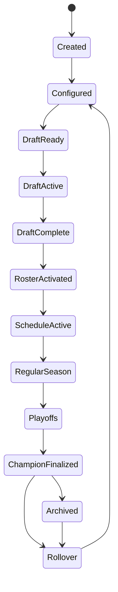
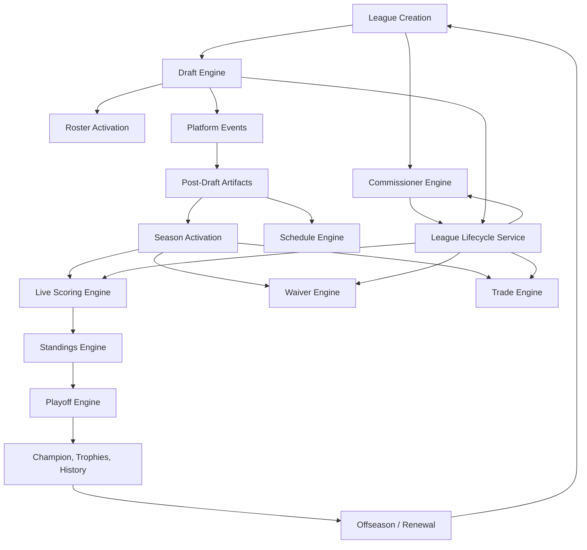

# G18 Core League Lifecycle Engine Audit

Readiness hold:

- NFL Engine: 93%
- Overall Platform: 90%

G18 is audit-first. No production lifecycle behavior was rewritten in this phase.

## 1. Lifecycle Diagram

Canonical target lifecycle:



Current implementation map:

| Canonical stage | Current state/source | Current owner |
| --- | --- | --- |
| Created | `League` row created | League creation routes/services |
| Configured | `League.lifecycleState = setup` | Canonical league creation |
| Draft Ready | `pre_draft` + `DraftSession.status = pre_draft` | Draft Engine |
| Draft Active | `drafting` + `DraftSession.status in_progress/paused` | Draft Engine |
| Draft Complete | `post_draft` + `DraftSession.status = completed` | Draft Engine + lifecycle service |
| Roster Activated | Canonical roster sync and Redraft roster sync side effects | Draft finalization services |
| Schedule Active | Redraft schedule rows created as post-draft artifacts | Redraft schedule/finalization path |
| Regular Season | `in_season` and/or `RedraftSeason.status = active` | Partially core, partially Redraft |
| Playoffs | `playoffs`, Redraft playoff bracket rows | Core lifecycle state + Redraft Playoff Engine |
| Champion Finalized | `completed`, `RedraftSeason.status = complete`, championship row | Redraft Playoff Engine |
| Archived | `archived` | Commissioner service |
| Rollover | `offseason -> renewal_pending -> setup` | Commissioner renewal routes + format engines |

## 2. State Machine

The core state machine lives in `server/services/leagueLifecycleService.ts`.

Current states:

- `setup`
- `pre_draft`
- `drafting`
- `post_draft`
- `in_season`
- `playoffs`
- `completed`
- `offseason`
- `renewal_pending`
- `archived`

Current transitions:

| From | To |
| --- | --- |
| `setup` | `pre_draft`, `archived` |
| `pre_draft` | `drafting`, `setup`, `archived` |
| `drafting` | `post_draft`, `pre_draft`, `archived` |
| `post_draft` | `in_season`, `drafting`, `archived` |
| `in_season` | `playoffs`, `completed`, `drafting`, `archived` |
| `playoffs` | `completed`, `in_season`, `archived` |
| `completed` | `offseason`, `archived`, `in_season` |
| `offseason` | `renewal_pending`, `setup`, `archived` |
| `renewal_pending` | `setup`, `archived` |
| `archived` | none |

Action gating is also centralized in `leagueLifecycleService.ts`, with shared route integration through `server/services/leagueActionGate.ts`.

Important behavior:

- Draft picks, waiver claims, roster edits, trades, scoring, standings, settings edits, automation, import sync, archive, renewal, and succession all have lifecycle action identifiers.
- Elevated commissioners can override many action gates, but locked/emergency-paused behavior is still enforced explicitly.
- `completeDraftSession()` applies the `post_draft` lifecycle transition in the same transaction that marks the draft complete.
- `finalizeRedraftSeasonChampion()` marks the league `completed`, but does so by direct `league.update` instead of `transitionLeagueState()`.

Canonical gap:

- `RosterActivated` and `ScheduleActive` are not first-class lifecycle states. They currently happen as side effects between `post_draft` and `in_season`.
- `RegularSeason` activation is not uniformly owned by the lifecycle engine. Redraft emits `SEASON_ACTIVATED` after creating Redraft season artifacts, but the League state transition to `in_season` is separate.

## 3. Engine Dependency Graph



Current dependencies:

| Area | Current integration |
| --- | --- |
| Draft Engine | Strong. Draft start/pick/complete paths call lifecycle helpers or gates. |
| Schedule Engine | Partial. Schedule generation is called from Redraft post-draft finalization and Redraft season creation, not core lifecycle. |
| Playoff Engine | Partial. Playoff finalization writes `League.lifecycleState = completed`; generation/advance remain Redraft-owned. |
| Waiver Engine | Strong action gating for claims/processing, but processing windows are not lifecycle transitions. |
| Trade Engine | Strong action gating for proposal/acceptance/processing; deadline/review lives in Trade Engine. |
| Commissioner Engine | Strong. Central service handles forced transitions, archive, settings gates, automation gates. |
| Live Scoring Engine | Partial. Weekly processing respects season rows; week advancement is not a core lifecycle transition. |
| Decision OS | Reads lifecycle and season context, but lifecycle hooks are advisory rather than canonical. |

## 4. Event Map

Platform lifecycle/competition events exist in `lib/events/catalog.ts`.

| Event | Current producer | Lifecycle role |
| --- | --- | --- |
| `EVENT.LEAGUE_CREATED` | Cataloged; creation paths are inconsistent | Should mark Created/Configured |
| `EVENT.DRAFT_STARTED` | Draft catalog | Should mark Draft Active |
| `EVENT.DRAFT_COMPLETED` | `completeDraftSession()` | Strong core event; format-agnostic |
| `EVENT.SEASON_ACTIVATED` | `syncCompletedDraftToRedraftSeason()` | Redraft-specific season activation payload |
| `EVENT.SCHEDULE_GENERATED` | Cataloged | Should be emitted by Core Schedule Engine once canonical |
| `EVENT.MATCHUP_CREATED` | Cataloged | Should belong to Schedule/Playoff engines |
| `EVENT.SCORE_UPDATED` | Cataloged | Live scoring/scoring processor |
| `EVENT.STANDINGS_UPDATED` | `lib/redraft/standingsEngine.ts` | Redraft standings recompute event |
| `EVENT.PLAYOFF_BRACKET_GENERATED` | Cataloged | G14 candidate; currently not consistently emitted |
| `EVENT.PLAYOFF_ADVANCED` | Cataloged | G14 candidate; currently not consistently emitted |
| `EVENT.CHAMPION_CROWNED` | `finalizeRedraftSeasonChampion()` | Strong Redraft producer; should be core playoff output later |
| `EVENT.SEASON_COMPLETED` | `finalizeRedraftSeasonChampion()` | Strong event, but coupled to Redraft playoff finalization |
| `EVENT.LEAGUE_ARCHIVED` | Cataloged; commissioner archive path logs/audits | Should be emitted from core transition |
| `EVENT.WAIVER_PROCESSED` / `EVENT.WAIVER_WINDOW_PROCESSED` | Waiver engine | Transaction lifecycle, not league stage |
| `EVENT.TRADE_*` | Trade engine | Transaction lifecycle, not league stage |

Important G12 result preserved:

- Draft completion is already a platform event instead of a Redraft event.

G18 gap:

- There is no single lifecycle event coordinator that consumes `DRAFT_COMPLETED` and performs `RosterActivated -> ScheduleActive -> SeasonActivated -> RegularSeason` through validated, idempotent steps.

## 5. Transition Table

| Transition | Current owner | Event/source | Persistence | Validation | Rollback behavior |
| --- | --- | --- | --- | --- | --- |
| Created -> Configured | Canonical creation service | League create | `League.status`, `League.lifecycleState`, settings, rosters | Preset/creation validation | DB transaction in canonical create |
| Configured -> Draft Ready | Draft setup/fill-empty-slots/commissioner flow | Manual commissioner action | `League.lifecycleState = pre_draft`, draft session | Commissioner auth, roster config checks in some routes | Best effort; not always checked after transition call |
| Draft Ready -> Draft Active | Draft start/pick flow | Commissioner start or first pick | `League.lifecycleState = drafting`, `DraftSession.status` | Draft pool readiness, lifecycle transition | Draft route starts session and transitions separately |
| Draft Active -> Draft Complete | `completeDraftSession()` | Board full/finalize | `DraftSession.status = completed`, `League.lifecycleState = post_draft` | Board completeness, transition helper | Same DB transaction for status + lifecycle |
| Draft Complete -> Roster Activated | Draft finalization / post-draft artifacts | `DRAFT_COMPLETED` side effects and explicit finalize routes | Canonical `RosterPlayer`, Redraft roster rows | Idempotency guards for existing rows | Mostly transactional per service |
| Roster Activated -> Schedule Active | Redraft finalizer / season route | Post-draft finalization | `RedraftSeason`, `RedraftMatchup` rows | Schedule generator checks, roster count | Transactional in Redraft finalizer/route |
| Schedule Active -> Regular Season | Manual/core transition plus Redraft `SEASON_ACTIVATED` | Redraft season activation | `League.lifecycleState = in_season`, `RedraftSeason.status = active` | Lifecycle transition if called | Not consistently coupled to season artifact creation |
| Regular Season -> Week Advanced | Redraft season/scoring routes and format engines | Cron/manual scoring | `currentWeek`, weekly score/matchup/standings tables | Scoring processor validations | Idempotent scoring recalculation, no core transition |
| Regular Season -> Playoffs | Lifecycle service and Redraft playoff generate route | Manual/commissioner | `League.lifecycleState = playoffs`, playoff bracket rows | Lifecycle transition + playoff seed generation | Bracket generation handles its own rows |
| Playoffs -> Champion Finalized | Redraft Playoff Engine | Commissioner finalize | `League.lifecycleState = completed`, `RedraftSeason.status = complete`, bracket/championship rows | Final round complete, champion exists | DB transaction for champion/season/bracket/league update |
| Champion Finalized -> Offseason | Commissioner/format services | Commissioner/renewal | `League.lifecycleState = offseason`, format settings | Lifecycle transition | Core transition service when used |
| Offseason -> Rollover | Renewal route/policy | Commissioner renewal | `renewal_pending`, new season setup | Renewal policy | Route-specific |
| Any allowed state -> Archived | Commissioner service | Head commissioner archive | `League.lifecycleState = archived` | Head commissioner | Forced core transition |

## 6. Plugin Extension Points

Core lifecycle should expose hooks without letting plugins replace the state machine:

| Hook | Core responsibility | Plugin examples |
| --- | --- | --- |
| `validateTransition` | Confirm state transition is legal and all required artifacts exist | Dynasty roster cuts complete before preseason; C2C college/pro calendars aligned |
| `beforeTransition` | Run format-specific blockers before persistence | Guillotine elimination checks; Survivor tribal council closed |
| `afterTransition` | Emit plugin side effects after core state is durable | Survivor idol bootstrap, tournament announcements, Decision OS summaries |
| `onDraftCompleted` | Receive `DRAFT_COMPLETED` for post-draft format work | Redraft roster activation, Dynasty rookie draft rights, Survivor tribe/idol bootstrap |
| `onRosterActivated` | Validate rosters before season activation | IDP slot validation, taxi/IR eligibility, Best Ball lineup model |
| `onScheduleActivated` | Verify regular-season schedule artifacts only | Tournament feeder league grouping, Guillotine weekly cadence |
| `onSeasonActivated` | Open waivers/trades/scoring windows | Keeper locks, Dynasty phase `in_season`, salary cap contract activation |
| `onWeekAdvanced` | Weekly plugin work | Guillotine cuts, Survivor challenge/council, Zombie infection, Big Brother veto/HOH windows |
| `onPlayoffsStarted` | Playoff-only plugin work | Tournament bracket phase, reseeding, consolation rules |
| `onChampionFinalized` | Trophies, history, payouts, archives | Dynasty record book, Keeper eligibility, finance payouts |
| `onOffseasonEntered` | Offseason prep | Contract expiration, rookie pools, devy declarations |
| `onRollover` | New season setup | Redraft reset, Keeper carryover, Dynasty continuity, C2C promotion |

Format notes:

- Dynasty/Keeper need offseason and carryover hooks, not separate lifecycle ownership.
- Best Ball should customize lineup/weekly scoring behavior, not league states.
- Guillotine/Survivor/Zombie/Big Brother need weekly advancement hooks.
- Tournament needs a parent competition lifecycle that coordinates child leagues.
- Devy/C2C need player-rights lifecycle hooks parallel to, but not replacing, league lifecycle.
- IDP should plug into roster/scoring validation before activation and waiver/trade gates.

## 7. Duplication Analysis

| Duplication | Files/paths | Risk |
| --- | --- | --- |
| Lifecycle state split across multiple models | `League.lifecycleState`, `League.status`, `DraftSession.status`, `RedraftSeason.status`, playoff bracket statuses, tournament/survivor/guillotine status fields | Engines can disagree about whether the league is live, in playoffs, or complete |
| Creation paths disagree | `lib/league-creation/canonical/createCanonicalLeagueInTransaction.ts`, `lib/redraft-creation/create-redraft-league.ts` | Canonical creation sets `lifecycleState = setup`; older Redraft creation relies on Prisma default `in_season` |
| Schedule/season activation hidden inside Redraft | `lib/redraft/finalizeDraftToRedraftSeason.ts`, `app/api/redraft/season/route.ts` | Future formats would need to duplicate post-draft activation |
| Playoff finalization bypasses transition service | `lib/redraft/playoffEngine.ts` | Direct lifecycle write skips transition audit/fanout behavior |
| Commissioner access helpers repeated | Redraft playoff/season routes and centralized commissioner service | Authorization and lifecycle gates can diverge |
| Format side-state engines are standalone | Devy/C2C rights lifecycle, Dynasty/Keeper offseason, Survivor/Guillotine/Tournament seasons | Plugin behavior is real but not coordinated by a common lifecycle hook contract |
| Weekly advancement is not canonical | Redraft scoring route, Survivor week-start, tournament automation, zombie finalize routes | Week changes can happen without a single `WeekAdvanced` lifecycle event |
| Event catalog is ahead of producers | `EVENT.SCHEDULE_GENERATED`, `PLAYOFF_BRACKET_GENERATED`, `PLAYOFF_ADVANCED`, `LEAGUE_ARCHIVED` | Consumers cannot reliably subscribe yet |

## 8. Gap Table

| Severity | Gap | File/path | Reason | Future impact |
| --- | --- | --- | --- | --- |
| High | Redraft creation can default new leagues to `in_season` | `lib/redraft-creation/create-redraft-league.ts`, `prisma/schema.prisma` | Prisma default is `in_season`; canonical creation explicitly sets `setup` | Draft/start gates and commissioner hub state can misclassify new Redraft leagues |
| High | Post-draft artifact chain is not a core lifecycle coordinator | `lib/redraft/finalizeDraftToRedraftSeason.ts`, `lib/live-draft-engine/postDraftFinalizeArtifacts` | Roster, season, schedule activation are format-owned side effects | Dynasty/Keeper/Best Ball/etc. will duplicate activation logic |
| High | Weekly advancement is not a core transition/event | Redraft scoring routes, Survivor/Tournament/Zombie automation | Week is stored/derived per format | Waivers, trades, scoring, lineup locks, and Decision OS cannot rely on a single week boundary |
| Medium | Playoff finalization writes lifecycle directly | `lib/redraft/playoffEngine.ts` | Uses `league.update` instead of `transitionLeagueState()` | Skips lifecycle transition audit/fanout and plugin hooks |
| Medium | Lifecycle POST normalizes unknown states to `in_season` | `app/api/leagues/[leagueId]/lifecycle/route.ts`, `leagueLifecycleService.ts` | `normalizeLifecycleState()` fallback is useful for legacy reads but risky for writes | A typo in an admin request could become an attempted in-season transition |
| Medium | `RosterActivated` and `ScheduleActive` are not first-class milestones | `server/services/leagueLifecycleService.ts` | Current states collapse multiple side effects into `post_draft` | Harder to prove readiness before opening season transactions |
| Medium | `SCHEDULE_GENERATED`, playoff generated/advanced, archive events are not consistently produced | `lib/events/catalog.ts` and engine routes | Catalog exists before producer wiring | Subscribers/plugins cannot trust event-driven lifecycle |
| Medium | Draft transition route does not check transition result | `app/api/leagues/[leagueId]/draft/transition-to-drafting/route.ts` | Calls `transitionLeagueState()` but proceeds regardless | Legacy bad states can start a draft while lifecycle remains wrong |
| Medium | Format lifecycle engines operate outside core | Devy, C2C, Dynasty, Keeper, Survivor, Guillotine, Tournament paths | They store phase/status in settings or format tables | Plugin architecture remains implicit |
| Low | UI labels omit `offseason` and `renewal_pending` | `lib/league/lifecycle-ui.ts` | Generic formatter covers them, but label map incomplete | Cosmetic consistency issue |
| Low | Testing relies heavily on source-contract tests | `__tests__/league-lifecycle-*`, Redraft lifecycle-related tests | Good for regressions, weaker for end-to-end state proof | Browser/staging proof still needed before readiness increase |

## 9. Migration Roadmap

Smallest-risk path:

1. Add a Core Lifecycle Engine wrapper around the existing `leagueLifecycleService.ts`.
   - Keep the current state enum.
   - Export transition descriptors, action gates, and hook registration points.
   - Do not rename states yet.

2. Separate legacy normalization from write validation.
   - Keep `normalizeLifecycleState()` for reads/legacy data.
   - Add `parseLifecycleStateForWrite()` that rejects unknown states.
   - Use it in `app/api/leagues/[leagueId]/lifecycle/route.ts`.

3. Align creation paths.
   - Make all new league creation paths explicitly set `lifecycleState = setup`.
   - Leave legacy existing leagues handled by read normalization and repair tooling.

4. Introduce idempotent lifecycle milestones without widening the enum.
   - Persist metadata markers for `rosterActivatedAt`, `scheduleActivatedAt`, `seasonActivatedAt`.
   - Keep public state as `post_draft` until the season is safe to open.

5. Move post-draft activation behind a core coordinator.
   - Subscribe to `EVENT.DRAFT_COMPLETED`.
   - Run format plugin hooks for roster activation.
   - Run schedule activation through the Core Schedule Engine candidate.
   - Transition `post_draft -> in_season` only after artifacts pass validation.

6. Route playoff completion through lifecycle transition service.
   - Replace direct `League.update({ lifecycleState: 'completed' })` with transaction-safe lifecycle helper.
   - Preserve Redraft season/bracket/championship writes.

7. Add a canonical `WeekAdvanced` concept.
   - Start as an event plus idempotency key, not necessarily a new enum state.
   - Let scoring, waivers, trades, lineup locks, Decision OS, Survivor, Guillotine, Tournament, and Zombie subscribe.

8. Convert format side-state into plugins.
   - Dynasty/Keeper offseason phase engines become lifecycle plugins.
   - Devy/C2C rights lifecycle remains a player-rights sub-state machine but plugs into offseason/rollover hooks.
   - Survivor/Guillotine/Tournament weekly state machines plug into week advancement.

9. Backfill transition/audit coverage.
   - Add tests for creation state, post-draft activation, invalid lifecycle writes, direct playoff completion, archive event, and week advancement idempotency.

## 10. Tests Run

Focused lifecycle and transition suite:

```text
cmd /c npx vitest run __tests__/league-lifecycle-service.test.ts __tests__/league-lifecycle-draft-completion.test.ts __tests__/draft/draft-completion-chain.test.ts __tests__/draft/finalized-roster-dashboard-sync.test.ts __tests__/draft/draftSliceALifecycle.test.ts __tests__/redraft/draft-finalize-contract.test.ts __tests__/redraft/draft-finalize-schedule.test.ts __tests__/redraft/playoff-advance.test.ts __tests__/redraft/playoff-finalize.test.ts __tests__/redraft/redraft-score-sync-cron.test.ts __tests__/redraft/season-rules-contract.test.ts __tests__/survivor-lifecycle-routes.test.ts __tests__/tournament-draft-flow.test.ts __tests__/c2c-season-playoffs-matrix.test.ts __tests__/league-create-c2c-startup-draft-bootstrap.test.ts
```

Result:

```text
Test Files  15 passed (15)
Tests       214 passed (214)
```

Related commissioner/trade/schedule sweep:

```text
cmd /c npx vitest run __tests__/commissioner-settings-service.test.ts __tests__/commissioner-settings-route.test.ts __tests__/nfl-redraft-commissioner-controls.test.ts __tests__/league-trade-engine-validation.test.ts __tests__/league-trade-process-route-auth.test.ts __tests__/redraft/trade-veto-route.test.ts __tests__/redraft/trade-settlement.test.ts __tests__/redraft/schedule-generator-ordering.test.ts __tests__/redraft/commissioner-scoring-contract.test.ts
```

Result:

```text
Test Files  9 passed (9)
Tests       111 passed (111)
```

Missing coverage to add in a later implementation phase:

- New Redraft creation lifecycle state.
- Invalid lifecycle POST rejects unknown state.
- Post-draft artifacts advance lifecycle only after roster + schedule activation.
- `SEASON_ACTIVATED` and `League.lifecycleState = in_season` are coupled or explicitly documented as separate.
- Playoff finalization uses lifecycle transition audit/fanout.
- Archive emits/records canonical lifecycle event.
- Week advancement emits one deterministic event per league/week.
- Plugin hook execution order and rollback semantics.

## 11. Readiness Assessment

Readiness should remain unchanged:

- NFL Engine: 93%
- Overall Platform: 90%

Reason:

G18 identified the Core League Lifecycle shape and confirmed that the existing lifecycle service is a strong base, especially for draft completion and action gates. The audit did not materially change runtime behavior, did not add browser/staging proof, and did not yet make post-draft season activation, weekly advancement, playoff completion, or rollover fully core-owned and plugin-ready.

Recommendation:

- Do not move to 94 from this audit alone.
- The most valuable next bounded fixes are creation-state alignment, write-safe lifecycle parsing, post-draft activation coordination, and routing playoff completion through the lifecycle transition service.
