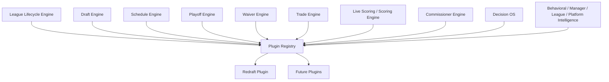

# G19 Core Plugin Framework Audit

Readiness hold:

- NFL Engine: 93%
- Overall Platform: 90%

G19 is architecture-first. The implementation added contracts and registry scaffolding only; it did not rewrite any Core Engine or change Redraft behavior.

## 1. Architecture Overview

The target architecture is:

```text
Core Engine owns behavior.
Plugin owns rules.
```

Core should not ask:

```ts
if (leagueType === 'dynasty')
```

Core should ask:

```ts
const plugin = getPlugin(leagueType)
await plugin.lifecycle?.onWeekAdvanced?.(context)
```

G19 created:

- `pluginTypes.ts`
- `pluginContracts.ts`
- `pluginRegistry.ts`
- `pluginHooks.ts`
- `pluginLifecycle.ts`
- `pluginLoader.ts`
- `PLUGIN_FRAMEWORK_ADR.md`
- `G19_CORE_PLUGIN_FRAMEWORK_AUDIT.md`

Redraft is mapped as Plugin #1 in `pluginLoader.ts`. This is a contract mapping, not a runtime migration.

## 2. Dependency Graph



Existing pre-framework registries that should be preserved and migrated behind the plugin facade:

| Existing system | Current role | G19 classification |
| --- | --- | --- |
| `lib/league/format-engine.ts` | Defines supported league formats, sports, draft types, capabilities | Should remain Core format metadata, then feed plugin metadata |
| `lib/league-concepts/resolveConceptPreset.ts` | Resolves creation preset and settings snapshot | Candidate for plugin creation/settings hooks |
| `lib/specialty-league/registry.ts` | Registers specialty league specs and UI/config/guards | Candidate for plugin registry migration |
| `lib/scoring-engine/conceptAdjustments.ts` | Concept scoring adjustment hook | Candidate for plugin scoring hooks |
| `lib/roster-lineup-engine/conceptRosterRules.ts` | Concept roster/lineup rule resolver | Candidate for plugin roster/scoring/commissioner hooks |
| `lib/draft-types/draftTypeRegistry.ts` | Draft type matrix | Should remain Core registry consumed by plugin draft rules |

## 3. Core vs Plugin Responsibility Matrix

| Area | Core owns | Plugin owns |
| --- | --- | --- |
| Lifecycle | State machine, legal transitions, audit/fanout, idempotency | Stage-specific rules, blockers, side effects |
| Draft | Session state, pick persistence, timers, board integrity | Draft type allowances, pick validation rules, roster materialization rules |
| Schedule | Canonical schedule persistence, matchup identity, lock/edit mechanics | Schedule shape, bye policy, division policy, rivalry/double-header rules |
| Playoffs | Bracket persistence, advancement transactions, champion finalization event | Qualification, seeding, reseeding, consolation, champion rules |
| Waivers | Claims, processing transaction, priority/FAAB persistence | Waiver type rules, bid constraints, priority policy, special free-agent windows |
| Trades | Proposal/execution transaction, audit/history, asset movement | Asset eligibility, pick trading policy, deadlines, review/veto policy |
| Scoring | Stat ingestion, score storage, correction replay, live scoring feed | Categories, modifiers, best-ball selection, specialty scoring twists |
| Commissioner | Auth, role gates, settings persistence, automation execution | Exposed settings, automation hooks, AI commissioner behaviors |
| Decision OS | Common context, explainability, recommendation transport | Format-specific inputs, risk models, manager/league intelligence modifiers |

## 4. Hook Catalog

Lifecycle hooks:

- `onLeagueCreated`
- `onLeagueActivated`
- `onDraftCreated`
- `onDraftCompleted`
- `onSeasonStarted`
- `onWeekAdvanced`
- `onPlayoffsStarted`
- `onChampionFinalized`
- `onLeagueArchived`
- `onSeasonRolledOver`

Draft hooks:

- `draftRules`
- `pickValidation`
- `timerBehavior`
- `rosterMaterialization`
- `draftCompletion`

Schedule hooks:

- `scheduleGenerator`
- `matchupPolicy`
- `byePolicy`
- `divisions`
- `doubleHeaders`
- `rivalryRules`

Playoff hooks:

- `qualificationRules`
- `bracketGenerator`
- `reseedingPolicy`
- `consolationRules`
- `championPolicy`

Waiver hooks:

- `waiverRules`
- `FAABRules`
- `priorityRules`
- `processingPolicy`

Trade hooks:

- `tradeRules`
- `assetValidation`
- `pickTradingRules`
- `deadlineRules`

Scoring hooks:

- `scoringRules`
- `scoringCategories`
- `liveScoringHooks`
- `statCorrectionHooks`

Commissioner hooks:

- `commissionerSettings`
- `automationHooks`
- `AIHooks`

Decision OS hooks:

- `managerIntelligenceInputs`
- `leagueIntelligenceInputs`
- `platformIntelligenceInputs`
- `recommendationInputs`

## 5. Plugin Registry

The registry is in `pluginRegistry.ts`.

Supported API:

```ts
registerPlugin(plugin)
getPlugin(leagueType)
requirePlugin(leagueType)
listPlugins()
```

Normalization currently handles:

- `bestball` -> `best_ball`
- `campus_to_canton`, `campus-2-canton`, `campus_2_canton` -> `c2c`
- `dynasty_idp` -> `idp`

This lets code migrate away from switch statements incrementally.

## 6. Redraft Mapping

Redraft Plugin #1 status:

| Contract | Status | Current implementation |
| --- | --- | --- |
| Lifecycle | Partially implemented | `leagueLifecycleService`, Redraft season finalizer, playoff finalizer |
| Draft | Implemented | `lib/live-draft-engine`, draft defaults, Redraft finalization |
| Schedule | Partially implemented | `lib/redraft/scheduleEngine.ts`, G13 audit |
| Playoffs | Partially implemented | `lib/redraft/playoffEngine.ts`, G14 audit |
| Waivers | Partially implemented | `lib/waiver-wire`, legacy Redraft paths, G16 audit |
| Trades | Partially implemented | `lib/league-trade-engine`, Redraft trade routes, G17 audit |
| Scoring | Partially implemented | sport config scoring, Redraft scoring runner, live scoring |
| Commissioner | Partially implemented | commissioner settings/routes, G15 audit |
| Decision OS | Partially implemented | Redraft AI/Decision OS context and analyzer routes |
| Intelligence | Partially implemented | AI commissioner, trade/waiver analysis, health signals |

Redraft behavior was not changed in G19. The plugin record documents where Redraft already satisfies the contract and where migration remains.

## 7. Future Plugin Mapping

| Plugin | Inherited behavior | Overridden behavior | New hooks required |
| --- | --- | --- | --- |
| Dynasty | Draft, schedule, scoring, waivers, trades, commissioner gates | Multi-year rosters, rookie drafts, taxi, future picks, offseason | `onSeasonRolledOver`, trade pick rules, roster carryover |
| Keeper | Redraft season flow, draft, schedule, scoring | Keeper declarations, round costs, keeper deadlines | keeper settings, roster materialization, rollover |
| Best Ball | Draft, schedule, scoring storage, standings | Automatic lineup optimization, no manual weekly lineup | scoring selection, lineup lock override |
| Guillotine | Draft, scoring, waivers, trades | Weekly elimination and roster release | `onWeekAdvanced`, waiver reset, eliminated roster guards |
| Survivor | Draft, scoring, lifecycle gates | Tribe/council/vote/idol/challenge mechanics | post-draft bootstrap, week advancement, archive/fair-play hooks |
| Tournament | Child league engines, schedule/scoring/standings | Multi-league advancement and redraft rounds | parent lifecycle, advancement, child league creation |
| Big Brother | Redraft-family scoring and rosters | Weekly twists, veto/head-of-household style mechanics | scoring modifiers, commissioner automation, week hooks |
| Zombie | Redraft-family draft/scoring/waivers/trades | Status transformations, infection/serum/weapons | weekly finalization, trade/waiver eligibility |
| Devy | Dynasty base, draft, scoring | College rights, declarations, promotion | offseason rights lifecycle, player pool hooks |
| C2C | Dynasty/Devy base, dual sport scoring | Campus/pro dual rosters, promotion windows | college/pro calendar hooks, rights promotion |
| IDP | Redraft/Dynasty base, scoring, roster validation | Defensive player positions and scoring | roster/scoring validation, draft pool filters |

## 8. Audit Findings

| Pattern | Classification | Notes |
| --- | --- | --- |
| `format-engine` registry | Should remain Core | Useful central metadata; should feed plugin metadata |
| Concept preset switch-like resolver | Candidate for plugin | `resolveConceptPreset.ts` builds settings snapshots by league type |
| Specialty registry | Candidate for plugin | Already plugin-shaped but scoped to specialty leagues |
| Concept scoring adjustments | Candidate for plugin | Current variant branch for Big Brother belongs in scoring plugin hook |
| Concept roster rules | Candidate for plugin | Good extension model; should be exposed under plugin contract |
| Legacy AI/import branches | Acceptable for now | Legacy routes can migrate after core engines |
| Core engine direct Redraft assumptions | Candidate for plugin | Schedule, playoff, season activation need plugin-aware adapters |
| Draft type registry | Should remain Core | Draft types are platform capabilities consumed by plugins |

## 9. Migration Roadmap

Stage 1: Plugin interfaces only.

- Completed in G19.
- Add deterministic registry/hook tests.
- Do not alter engine behavior.

Stage 2: Redraft becomes Plugin #1.

- Move Redraft metadata into `RedraftPlugin`.
- Add plugin-aware adapters around creation, draft completion, season activation, schedule generation, playoffs, waivers, trades, scoring, and commissioner settings.
- Keep existing functions as implementation providers behind the plugin.

Stage 3: Shared engine extraction.

- Replace core-engine format branches with plugin contract calls.
- Keep format-engine metadata as Core.
- Fold specialty registry specs into plugin descriptors.

Stage 4: Future plugins.

- Add Dynasty, Keeper, Best Ball, Guillotine, Survivor, Tournament, Big Brother, Zombie, Devy, C2C, and IDP as plugins.
- Each plugin extends Core and overrides only rule hooks.

No breaking changes:

- Existing routes stay intact until their plugin-backed adapter is tested.
- Existing Redraft behavior remains the regression baseline.
- Readiness does not increase until plugin-backed runtime paths are verified.

## 10. Test Coverage

G19 adds deterministic contract tests for:

- Registry lookup.
- Alias normalization.
- Redraft plugin registration.
- Lifecycle hook execution.
- Hook catalog coverage.

Verification command:

```text
cmd /c npx vitest run __tests__/plugin-framework-contract.test.ts __tests__/draft/draft-completion-chain.test.ts __tests__/redraft/draft-finalize-contract.test.ts __tests__/redraft/draft-finalize-schedule.test.ts __tests__/league-lifecycle-service.test.ts
```

Result:

```text
Test Files  5 passed (5)
Tests       41 passed (41)
```

## 11. Readiness Assessment

Readiness remains:

- NFL Engine: 93%
- Overall Platform: 90%

Reason:

G19 creates the reusable plugin contract and registry foundation, but it does not yet migrate runtime engine behavior through the plugin framework. This is a major architecture step, not a customer-visible engine improvement.
